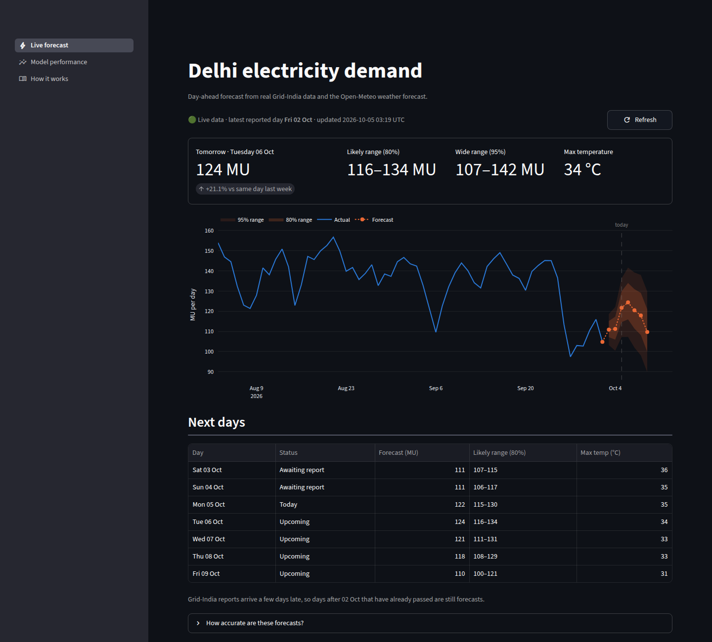
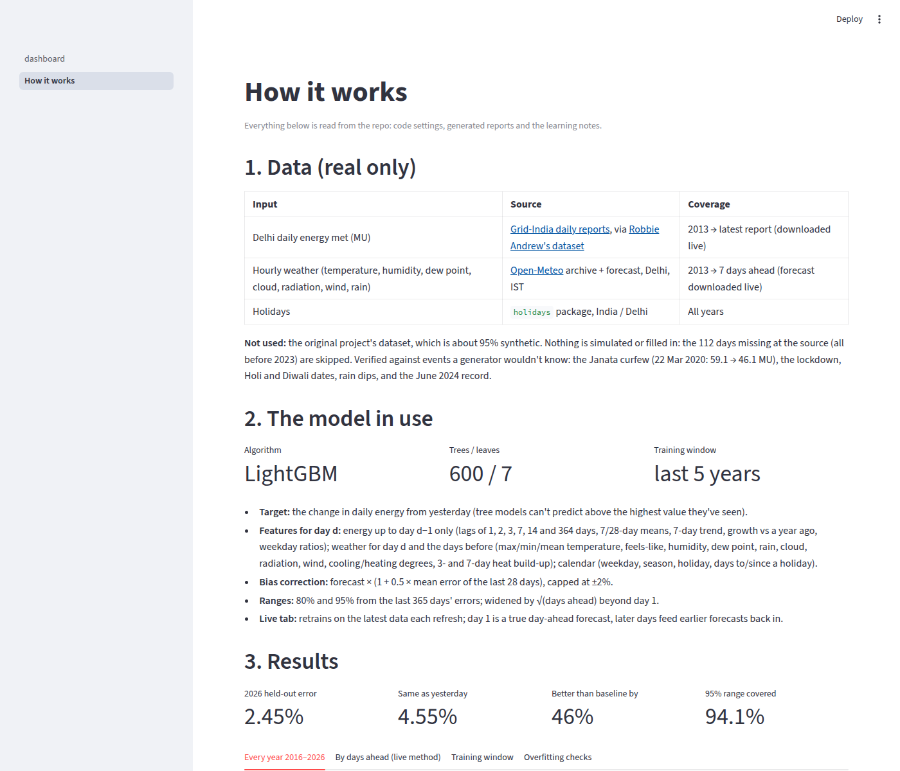

# Delhi electricity demand forecasting

**Live dashboard: https://loaddelhi.streamlit.app/** (fetches the latest real data and forecasts the next 7 days)

Day-ahead forecast of Delhi's daily electricity demand, trained and tested on **real data only**: Grid-India daily reports and Open-Meteo weather.

| Test | Model (MAPE) | Same as yesterday | Same day last week |
|---|---|---|---|
| Development: walk-forward over 2025 | 2.46% | 4.23% | 7.92% |
| **2026 held out (1 Jan – 30 Sep, 273 days)** | **2.45%** | 4.55% | 10.12% |
| Every year 2016–2026, each trained on the 5 years before | median 2.48% (2.37–3.14%) | beaten 11/11 years | |

* Each forecast is corrected by half its mean error over the last 28 days, capped at ±2% (removes most of a small under-forecast: bias −0.94% → −0.41% on 2026).
* Intervals come from the last 365 days' errors: the 95% interval covers 94.1% of 2026 days (93–97% in every year since 2016), the 80% interval 77.7%.
* Without a weather forecast for the target day, the error is 3.35%. Results above use recorded weather as a stand-in for a forecast.
* A linear model on the same features gets 2.61%, so most of the skill comes from the features, not the model's complexity.
* Model v2 (heat build-up, growth, holiday-distance and weekday features, 5 training years) was chosen on the 2016–2025 yearly test, where it cut mean error from 2.82% to 2.69%; 2026 then improved from 2.73% to 2.57%.

## Live dashboard

`streamlit run app/dashboard.py` opens on a **Live forecast** tab. On load, and on **Refresh now** (otherwise hourly), it:

1. downloads the latest Grid-India daily data (via Robbie Andrew's dataset on GitHub) and the Open-Meteo weather forecast;
2. retrains the model on the latest 5 years;
3. forecasts each day from the latest reported day up to 7 days ahead, with 80%/95% ranges, and marks which days
   have already passed but aren't reported yet (Grid-India publishes with a delay).

If a live source can't be reached, it falls back to the committed copy and says so; nothing is filled in.



A second page, **How it works**, lists the data sources, the model and its settings (read from the code), every
result table, every model used in the project, the learning log and the limits.



### Put it online (free, Streamlit Community Cloud)

1. Sign in at [share.streamlit.io](https://share.streamlit.io) with GitHub.
2. Click **Create app** and choose: repository `anshajshuklaa/Load-Forecasting`, branch `main`,
   main file `app/dashboard.py`, Python 3.11.
3. Click **Deploy**. It installs `requirements.txt` and gives a public `https://<name>.streamlit.app` link.
   This project's deployment: https://loaddelhi.streamlit.app/

The app downloads live data from raw.githubusercontent.com and api.open-meteo.com, both reachable from
Streamlit Cloud. Docker works too: `docker compose up` serves it on port 8501.

| Days ahead | Error (2025 test) | 95% range covered |
|---|---|---|
| 1 | 2.26% | 96% |
| 2–3 | 3.75–3.76% | 92–96% |
| 4–7 | 3.90–4.19% | 98–100% |

Days 2–7 feed earlier forecasts back in as "yesterday", so they are less accurate and their ranges are wider
(`reports/multiday.md`; tested with recorded weather, so real days 2–7 also carry weather-forecast error).

## Why the model trains on the last 5 years

More history helps up to about 5 years, then stops helping. Each year 2019–2025 is forecast day-ahead by a model
trained only on the years before it (`python scripts/training_window.py`, full table in `reports/training_window.md`):

| Training window | Average error, 2019–2025 | 2019 | 2020 | 2021 | 2022 | 2023 | 2024 | 2025 |
|---|---|---|---|---|---|---|---|---|
| 2 years | 2.79% | 2.49% | 3.43% | 3.04% | 2.83% | 2.63% | 2.53% | 2.58% |
| 3 years | 2.72% | 2.56% | 3.37% | 2.94% | 2.58% | 2.62% | 2.44% | 2.50% |
| **5 years (used)** | **2.67%** | 2.42% | 3.25% | 2.94% | 2.57% | 2.58% | 2.46% | 2.45% |
| 8 years | 2.68% | 2.39% | 3.41% | 2.92% | 2.63% | 2.50% | 2.46% | 2.44% |
| All history (since 2013) | 2.69% | 2.39% | 3.41% | 2.92% | 2.66% | 2.52% | 2.51% | 2.42% |

**Why:** Delhi's demand changed. The average level grew about 27% (82 → 104 MU/day, 2013 → 2025), and the extra
summer demand per °C of heat rose from 1.3% (2013) to 5.4% (2021, the COVID years at home with AC) before falling back
to about 2% (2025). Older years teach a heat response the city no longer has. Weighting older days less (half-life
1–5 years) or down-weighting the COVID period did not beat the plain 5-year window.

**How these numbers were checked (no simulation):** the script asserts that every energy value the model sees equals
the Grid-India file value and that every training period ends before its test year. The 112 days missing at the source
(all before 2023) are skipped, never filled in. Training is deterministic, so reruns give identical numbers. The only
made-up values in the repo are small in-memory examples inside the unit tests (`tests/`), which check code logic and
are never used for training or results.

## Quick start

```bash
pip install -r requirements-app.txt
pytest -q                               # leak tests, holdout split, scraper parser
python -m pipeline.daily backtest       # development, 2026 excluded
python -m pipeline.daily holdout        # 2026 test + intervals
python scripts/rolling_years.py         # every year 2016–2026
python scripts/overfit_check.py         # overfitting checks
python scripts/training_window.py       # training-window test with provenance checks
python -m pipeline.forecast             # forecast tomorrow (needs api.open-meteo.com)
streamlit run app/dashboard.py          # dashboard with live data and forecast
python scripts/multiday_check.py        # accuracy of the live 7-day forecast, by day
```

## How it works

```
Grid-India daily energy met (data/posoco)    Open-Meteo weather, IST (data/weather)
                 │                                         │
                 └──────────────┬──────────────────────────┘
                                ▼
   features for day d: energy from days ≤ d-1 only (lags, 7/28-day means, trend, growth vs last year,
   weekday ratios), weather for d and the days before (3/7-day heat build-up), calendar, holiday distance
                                ▼
   LightGBM (7 leaves, 600 trees, last 5 years) predicts the change from yesterday
                                ▼
   bias correction (half the last 28 days' mean error) + intervals from the last 365 days' errors,
   both using only errors known the day before
```

A test (`tests/test_daily.py`) fails if any feature for day d changes when energy on day d or later changes.

## Data

* `data/posoco/delhi_daily.csv`: Delhi's daily energy met (MU), 2013 to Oct 2026, from [Grid-India daily reports](https://posoco.in/reports/daily-reports/) via [Robbie Andrew's dataset](https://robbieandrew.github.io/india/). It was checked against events a generator would not know: the COVID curfew and lockdown, Holi and Diwali dates, rain dips and the June 2024 record (`reports/data_audit.md`).
* `data/weather/delhi_hourly.csv`: [Open-Meteo archive](https://open-meteo.com/), 2013 to Sep 2026.

## Repo map

| Path | What |
|---|---|
| `pipeline/daily.py` | Daily model: features, backtest, holdout, bias correction, intervals |
| `learning/` | `changes.md` (learning log), `models.md` (every model used and what it taught), `analysis.md` (audit and results), `gaps.md` (fixes and open gaps) |
| `pipeline/forecast.py` | Tomorrow's forecast and live scoring (run daily by `.github/workflows/daily-forecast.yml`) |
| `app/dashboard.py`, `pipeline/live.py` | Streamlit dashboard; live data fetch and 7-day forecast |
| `pipeline/sldc.py`, `pipeline/real.py` | Real hourly data: SLDC scraper (needs an Indian IP) and the all-real hourly path |
| `pipeline/features.py`, `train.py`, `legacy.py` | Leak-free hourly pipeline (legacy, mostly synthetic data; `PIPELINE.md`) |
| `reports/` | Every reported number, written by scripts |
| `load_forecast_new/` | Original project, superseded (synthetic data, leakage, hard-coded claims) |

## Limitations

See `learning/gaps.md`. The main ones:
* The real-data results are **daily energy only**. Hourly needs the SLDC scrape from an Indian IP.
* 2026 was looked at before the final model size was chosen (on 2025 data), and this is disclosed. The live forecasts in `reports/live/` are the clean out-of-sample test from now on.
